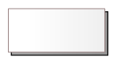
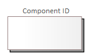
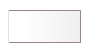
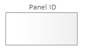

# Definicje elementów modelowania interfejsów użytkownika

## Wprowadzenie

Niniejszy artykuł opisuje i definiuje elementy udostępniane do modelowania interfejsów użytkownika.

## Komponent

Komponent reprezentuje element systemu obsługującego interfejsu użytkownika. Jest to samodzielny byt który może funkcjonować w wielu instancjach. Może być uruchamiany w wyniku działalności użytkownika lub na skutek zdarzeń generowanych kontekstowo niezależnie od niego.

Komponent na modelu jest reprezentowany przez:

lub:

`Component ID` identyfikuje komponent i może być wykorzystany jako nazwa w kodach źródłowych przygotowywanych przez wykonawców.

Komponent może zawierać panele lub podstawowe elementy interfejsu użytkownika.

## Panel

Panel jest to integralna część komponentu. Reprezentuj fragment interfejsu użytkownika udostępnianego przez komponent. Powinien być wykorzystywany jako element dekompozycji na logiczne fragmenty obsługiwane samodzielnie zgodnie z zasadami założonymi przez projektanta.  

Panel na modelu jest reprezentowany przez:

lub:

Panel może zawierać inne panele lub podstawowe elementy interfejsu użytkownika.

## Podstawowe elementy interfejsu użytkownika

Zaliczamy do nich:

* przycisk
* opcja wyboru wielokrotnego
* opcja wyboru jednokrotnego
* obrazek
* pole edycyjne do wprowadzania daty
* pole edycyjne
* pole nawigacyjne
* lista rozwijana
* pole statycznego tekstu
* zakładka
* pole edycyjne do wprowadzania tekstu