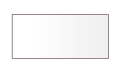
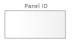

# Description of User Interface Modeling Elements - Panel

## Panel

A panel is an integral part of a component. It represents a fragment of the user interface provided by the component. It should be used as an element for decomposing the interface into logical parts that are independently handled according to the principles established by the designer.

In the model, the panel is represented by:

or:

The panel may contain other panels or basic user interface elements.
