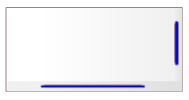
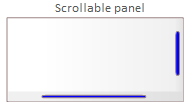
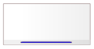
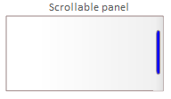
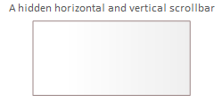

# Description of User Interface Modeling Elements - Panel

## Panel

A panel is an integral part of a component. It represents a fragment of the user interface provided by the component. It should be used as an element for decomposing the interface into logical fragments that can be independently managed according to the designer’s principles.

There are two variants:

* a simple panel
* a scrollable panel

### Simple Panel

In the model, the panel is represented by:

or:

The panel may contain other panels or basic user interface elements.

### Scrollable Panel

A scrollable panel in the model can be presented in the following variants:

or:

or:

or:

or:

A scrollable panel should be used for building various types of lists (e.g., tabular lists or standard lists). Its use indicates that the panel’s content will be scrollable when it exceeds the panel’s dimensions.

A panel can contain other panels or basic user interface elements.

Scrollbars are displayed to indicate the need to scroll content horizontally, vertically, or in both directions. It is assumed that if the content does not exceed the panel’s dimensions, the scrollbars are either disabled or not displayed (depending on the tools used or other design decisions).
