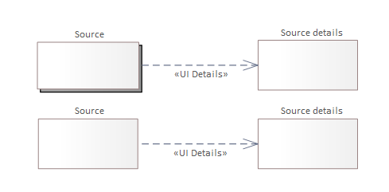
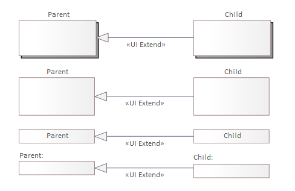
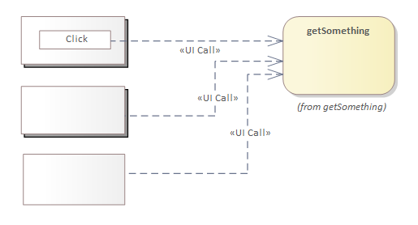

# Description of Relationships Used for Modeling Dependencies Between User Interface Elements

## Introduction

Relationships connect two elements present on the diagram, represented by:

* [component](./component.md#component)
* [panel](./panel.md#panel)
* [basic elements](./basic-elements.md)

## Detailing Relationship

Described by the `UI Details` stereotype. It specifies the detailing of the source element by the target element. It facilitates:

* presenting the structure of the designed user interface,
* describing the specifics of individual elements.

The detailing relationship should be used in connections between a component and a panel or between panels. The arrowhead of the dependency relationship points to the element that provides detail.

The following diagram shows examples of detailing:

The examples should be interpreted as follows:

* the user interacts with the element identified as `source`,
* the detailed description with decomposition is shown as the element identified as `Source details`.

## Extension Relationship

Described by the `UI Extend` stereotype. It represents an inheritance dependency typical in object-oriented modeling. It serves as a suggestion for the development team to use an existing element to implement the element needed for the designed user interface and apply inheritance or extension techniques during development (depending on the tools used).

The arrowhead points to the parent element, from which characteristics are inherited by the child element.

This relationship should be used to connect:

* component - component
* panel - panel
* basic element - basic element

Examples of extensions are shown in the following diagram:

## Display Relationship

Represented by the stereotypes:

* `UI Show`
* `UI Show In Modal`
* `UI Show In Left Panel`
* `UI Navigate`

These are used to describe a dependency where the element indicated by the arrowhead is displayed as a result of an event on the source element (e.g., button press, initialization). The display method is specified by the stereotype on the relationship.

The following diagram shows examples of using the display relationship:

### UI Show

`UI Show` represents the simplest form of display. It can be used to show a fragment of the user interface, such as a selection list or a contextually triggered search. The element indicated by the arrowhead is displayed relative to the source element based on the `Position` attribute.

The example shows displaying a component below the button, adjacent to it.

### UI Show In Modal

`UI Show In Modal` represents a display form where the target component is shown in a modal. This means displaying the element indicated by the arrowhead in a layer that overlays the source element, blocking interaction with it. The `Position` attribute on the relationship specifies the location on the user’s screen where the element is displayed. The example shows the value `Center` for centering both vertically and horizontally.

### UI Navigate

`UI Navigate` describes transferring control from one user interface represented by the source component to another indicated by the arrowhead. This relationship should be used to handle typical navigation actions that change functionality, where the source element is replaced by the target.

### UI Show In Left Panel

The `UI Show In Left Panel` relationship was added to MDG for compatibility with previous projects by the authors. It will eventually be replaced by `UI Show In Modal` with the `Position` attribute set to `Left`. This relationship describes launching the indicated component as a modal pinned to the left side of the user view. The displayed element occupies the space from top to bottom. The width of the modal adapts to the width of the component displayed within it.

## Call Relationship

Represented by the `UI Call` stereotype. It describes calling an operation or activity.

The following diagram shows examples of using the call relationship:

This relationship can be used to link an API operation described in the backend team's documentation. It allows for building a knowledge base of dependencies between elements of the functioning system and making more informed decisions when changes are required.

The API operation call may occur automatically before, during, or after displaying a component or panel. The handling of the call can be detailed using a [rule element](./rule-elements.md#rule) or [data processing rule element](./rule-elements.md#data-processing-rule).
