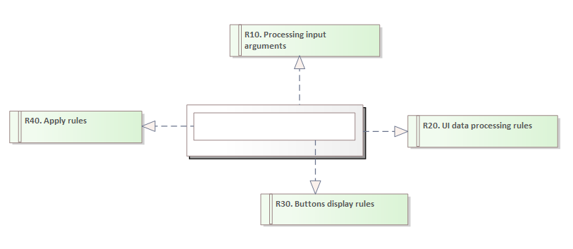

# Description of Elements Defining Functioning or Processing Rules of Modeled User Interfaces

## Introduction

This article describes user interface modeling elements that can represent descriptions of:

* rules for the functionality of user interface elements
* detailed rules for processing and storing data in designed components
* the launch interface of the executed component

These elements can be used to establish requirements that should be met during the execution of user interface elements.

These rules are defined as the following elements:

* input data processing rules
* data processing and maintenance rules in the user interface
* functionality rules

These elements are connected with a realization relationship to the component, panel, and basic elements.

Their use is shown in the following diagram:

## Input Data Processing Rule

This rule allows for describing the input data of a user interface component. These are the data passed to the component upon launch, enabling its parameterization and data feeding for processing. In the above diagram, this element is represented as `R10`.

The input argument processing rule element should appear on the diagram only once and should be connected with a realization relationship to the component.

## Data Processing Rule

This element allows describing the rules for processing and storing data in the component, enabling the data to be named, initial state defined, and change rules established. In the above diagram, it is represented as `R20`.

It should:

* appear on the diagram as a single instance,
* be associated with the component element.

## Rule

Represents a detailing description of the associated element. It can serve as a note indicating how the component should be implemented, describe animation mechanics, or functionality rules. In the above diagram, the rules are represented by two elements, `R30` and `R40`. `R30` describes the rules for displaying buttons, while `R40` specifies the rules that apply when the `Apply` button is pressed.

This element may appear multiple times on the diagram.
