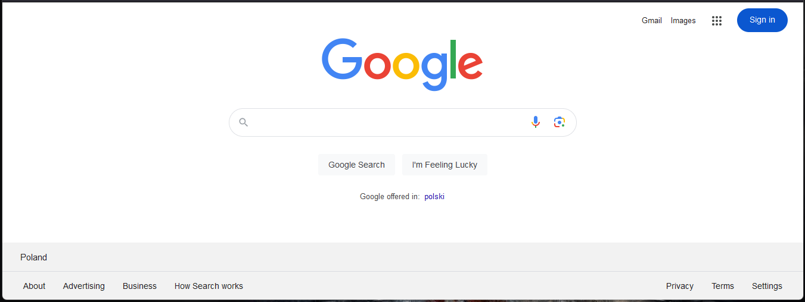

# User Interface Modeling Example Based on Google Search

## Introduction

This article discusses an example of using user interface modeling based on Google's search engine.

The presented model does not reflect the full complexity of Google Search.

## Google Search

The following image shows the search engine page:

The user interface of the search engine can be divided into three areas:

* header panel (1)
* search panel (2)
* footer panel (3)

The division is shown in the following diagram:

The header and search panels are functional areas. In addition to the user interface for searching, they provide options to change the operating mode or access other services offered by Google.

The footer panel is an informational area containing legally required information, such as terms and privacy policies.

## Model

The following image shows Google Search modeled using the described tools:

.

The search engine is represented as a component consisting of three panels. Each panel has a linked detailed panel. The panels managing areas 1 and 3 primarily handle links to other Google services or to informational pages (terms, etc.). A link is represented as a button in the model. Clicking it leads to functionality described as a component. The transition is described using the `UI Navigate` relationship.

A noteworthy feature is the option located to the left of the `Sign in` button. This option is represented in the diagram as a button linked to a panel using the `UI Show` relationship with the `Position` attribute set to `Below`. This represents functionality where, upon clicking the `Sign in` button, a panel listing available Google services is displayed. The panel appears below the button. Services are displayed as a list arranged in three columns. Each service is shown as an icon with its name. In the diagram, the list is shown as a scrollable panel. Services are represented as individual panels, with each linked to a detailed panel using the `UI Details` relationship.

Area 2 describes the core functionality of the search engine. In addition to the Google logo, it includes an element for entering the search query. Additional options are also displayed. Entering a query in the input field or clicking the button to the left of the input field displays a suggestion panel.

This panel is displayed below the input field (in the model, this is represented by connecting the button to the panel using the `UI Show` relationship with the `Position` attribute set to `Below`). It is modeled as a list of elements and option buttons. Each item has a detailed breakdown represented as a panel containing an icon, a suggestion, and a topic. The rules for displaying suggestion data are described in a requirement linked to the panel.

A particularly noteworthy feature is the button that opens the on-screen keyboard. This button is located to the right of the search input field. The relationship (`UI Show As`) linking this button to the component managing the on-screen keyboard describes the display as a non-blocking overlay, shown in the bottom-right corner of the browser view. This is specified in the relationship using the `Type` attribute set to `Overlay` and the `Position` attribute set to `Bottom Right`.
