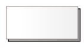

# Definicje elementów modelowania interfejsów użytkownika

## Wprowadzenie

Niniejszy artykuł opisuje i definiuje elementy udostępniane do modelowania interfejsów użytkownika.

## Komponent

Komponent reprezentuje element systemu obsługującego interfejsu użytkownika. Jest to samodzielny byt który może funkcjonować w wielu instancjach. Może być uruchamiany w wyniku działalności użytkownika lub na skutek zdarzeń generowanych kontekstowo niezależnie od niego.

Komponent na modelu jest reprezentowany przez:

lub:

`Component ID` identyfikuje komponent i może być wykorzystany jako nazwa w kodach źródłowych przygotowywanych przez wykonawców.

Komponent może zawierać panele lub podstawowe elementy interfejsu użytkownika.

## Panel

Panel jest to integralna część komponentu. Reprezentuj fragment interfejsu użytkownika udostępnianego przez komponent. Powinien być wykorzystywany jako element dekompozycji na logiczne fragmenty obsługiwane samodzielnie zgodnie z zasadami założonymi przez projektanta.  

Panel na modelu jest reprezentowany przez:

lub:

Panel może zawierać inne panele lub podstawowe elementy interfejsu użytkownika.

## Podstawowe elementy interfejsu użytkownika

Zaliczamy do nich:

* przycisk (`button`)
* opcja wyboru wielokrotnego (`checkbox`)
* opcja wyboru jednokrotnego (`radio`)
* obrazek (`image`)
* pole edycyjne do wprowadzania daty (`input with date picker`)
* pole edycyjne (`input`)
* pole nawigacyjne (`navbar`)
* lista rozwijana (`select`)
* pole statycznego tekstu (`static text`)
* zakładka (`tab`)
* pole edycyjne do wprowadzania tekstu (`textarea`)

Stanowią atomowe elementy konstrukcji modeli. Układane powinny być jako części składowe komponentów lub paneli.

## Relacja uszczegółowienia

Opisywana jest stereotypem `UI Details`. Określa uszczegółowienie elementu źródłowego przez element docelowy. Ułatwia przedstawienie i uszczegółowienie struktury projektowanego interfejsu użytkownika.

Uszczegółowienie powinno być wykorzystywane w powiązaniu między komponentem i panelem i między panelami. Grot strzałki relacji zależności wskazuje element stanowiący uszczegółowienie.

Na poniższym schemacie przedstawione zostały przykłady uszczegółowienia:

## Relacja rozszerzenia

Opisywana jest stereotypem `UI Extend`. Reprezentuje zależność dziedziczenia, charakterystycznego przy modelowaniu klas. Definiuje sugestię do wykorzystania istniejącego elementu do implementacji elementu potrzebnego do realizacji projektowanego interfejsu użytkownika. Stanowi sugestię dla zespołu developerskiego do wykorzystania struktur dziedziczenia w czasie implementacji.

Grot strzałki wskazuje element rodzica z którego dziedziczone są cechy przez element potomny (dziecko).

Relacja powinna być wykorzystywana do łączenia:

* komponent - komponent
* panel - panel
* element podstawowy - element podstawowy

Przykłady rozszerzenia przedstawione zostały na poniższym rysunku:

