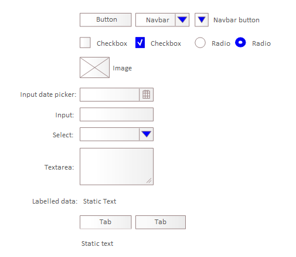

# Opis podstawowych elementów modelowania interfejsów użytkownika

## Podstawowe elementy interfejsu użytkownika

Zaliczamy do nich:

* przycisk (`button`)
* opcja wyboru wielokrotnego (`checkbox`)
* opcja wyboru jednokrotnego (`radio`)
* obrazek (`image`)
* pole edycyjne do wprowadzania daty (`input with date picker`)
* pole edycyjne (`input`)
* pole nawigacyjne (`navbar`)
* lista rozwijana (`select`)
* pole statycznego tekstu (`static text`)
* zakładka (`tab`)
* pole edycyjne do wprowadzania tekstu (`textarea`)

Stanowią atomowe elementy konstrukcji modeli. Układane powinny być jako części składowe komponentów lub paneli.

Powyższe elementy zostały pokazane na poniższym rysunku:

