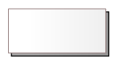
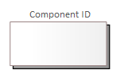

# Opis elementów modelowania interfejsów użytkownika - komponent

## Komponent

Komponent reprezentuje element systemu obsługującego interfejsu użytkownika. Jest to samodzielny byt który może funkcjonować w wielu instancjach. Może być uruchamiany w wyniku działalności użytkownika lub na skutek zdarzeń generowanych kontekstowo niezależnie od niego.

Komponent na modelu jest reprezentowany przez:

lub:

`Component ID` identyfikuje komponent i może być wykorzystany jako nazwa w kodach źródłowych przygotowywanych przez wykonawców.

Komponent może zawierać panele lub podstawowe elementy interfejsu użytkownika.
