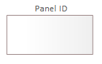

# Opis elementów modelowania interfejsów użytkownika - panel

## Panel

Panel jest to integralna część komponentu. Reprezentuj fragment interfejsu użytkownika udostępnianego przez komponent. Powinien być wykorzystywany jako element dekompozycji na logiczne fragmenty obsługiwane samodzielnie zgodnie z zasadami założonymi przez projektanta.  

Panel na modelu jest reprezentowany przez:

lub:

Panel może zawierać inne panele lub podstawowe elementy interfejsu użytkownika.
