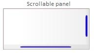
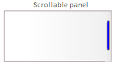

# Opis elementów modelowania interfejsów użytkownika - panel

## Panel

Panel jest to integralna część komponentu. Reprezentuje fragment interfejsu użytkownika udostępnianego przez komponent. Powinien być wykorzystywany jako element dekompozycji na logiczne fragmenty obsługiwane samodzielnie zgodnie z zasadami założonymi przez projektanta.  

Występuje w dwóch wariantach:

* prostego panelu
* panelu z możliwością scrollowania

### Prosty panel

Panel na modelu jest reprezentowany przez:

lub:

Panel może zawierać inne panele lub podstawowe elementy interfejsu użytkownika.

### Panel scrollowalny

Panel scrollowalny na modelu może być przedstawiony w następujących wariantach:

lub:

lub:

lub:

lub:

Panel scrollowalny powinien być wykorzystywany do budowy różnego rodzaju zestawień (zestawienia tabelarycznego, czy listy). Jego wykorzystanie informuje, że zawartość panelu będzie scrollowalna w sytuacjach, gdy przekroczy rozmiary panelu.

Panel może zawierać inne panele lub podstawowe elementy interfejsu użytkownika. Scrollbary pokazywane są w celu pokazania potrzeby przesuwania zawartości w poziomie lub pionie lub w obu kierunkach. Zakłada się, że w przypadku, gdy zawartość nie przekracza rozmiarów panelu to scrollbary są zablokowane albo nie wyświetlane (zależnie od wykorzystywanych narzędzi lub innych decyzji projektowych).

Panele mogą mieć wyświetlaną nazwę (na powyższym rysunku `Scrollable panel`, `A hidden horizontal and vertial scrollbar`).