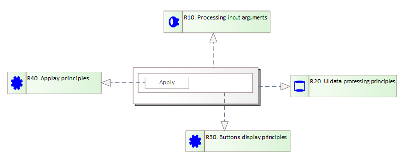

# Opis elementów definiujących zasady funkcjonowania lub przetwarzania modelowanych interfejsów użytkownika

## Wprowadzenie

W niniejszym artykule opisane zostały elementy modelowania interfejsów użytkownika, które mogą stanowić opis:

* zasad funkcjonowania elementów interfejsów użytkownika
* zasad szczegółowych zasad przetwarzania i przechowywania danych w projektowanych komponentach
* interfejsu uruchomieniowego wykonywanego komponentu

Elementy te mogą zostać wykorzystanie do ustalenia wymagań, które powinny być spełnione w czasie wykonania elementów interfejsu użytkownika.

Zasady te są definiowane w postaci następujących elementów:

* zasady przetwarzania danych wejściowych
* zasady przetwarzania i utrzymania danych w interfejsie użytkownika
* zasady funkcjonowania

Elementy te łączą się relacją realizacji z komponentem, panelem i elementami podstawowymi.

Ich użycie pokazane zostało na poniższym schemacie:

## Zasada przetwarzania danych wejściowych

Umożliwia opisanie danych uruchomieniowych komponentu interfejsu użytkownika. Są to dane przekazywane do uruchamianego komponentu. Pozwalają na jego parametryzację, zasilenie w dane do przetwarzania. Na powyższym schemacie element ten został przedstawiony jako `R10`.

Element zasady przetwarzania argumentów wejściowych powinien znaleźć się na diagramie tylko raz. Powinien być połączony relacją realizacji z komponentem.

## Zasada przetwarzania danych

Element ten umożliwia opisanie zasad przetwarzania i przechowywania danych komponentu, pozwalając nazwać je, opisać ich stan inicjalny i określić zasady zmiany. Na powyższym rysunku został przedstawiony jako `R20`.

Powinien:

* wystąpić na diagramie w postaci jednej kopii,
* być powiązany z elementem komponentu.

## Zasada

Reprezentuje opis uszczegóławiający elementu powiązanego. Może stanowić notatkę wskazującą jak ma być komponent zaimplementowany. Może opisywać mechaniką animacji, czy zasady funkcjonowania. Na powyższym schemacie zasady przedstawione zostały w postaci dwóch elementów `R30`, `R40`. `R30` opisuje zasady wyświetlania przycisków, a `R40` zasady obowiązujące po naciśnięciu przycisku `Apply`.

Element na diagramie może wystąpić wiele razy.
