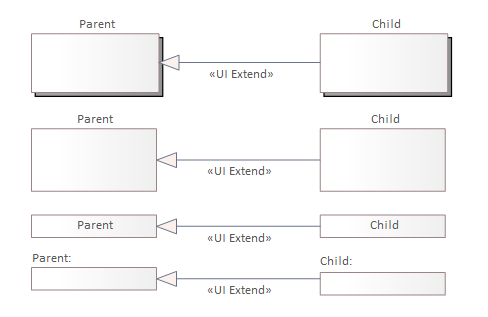
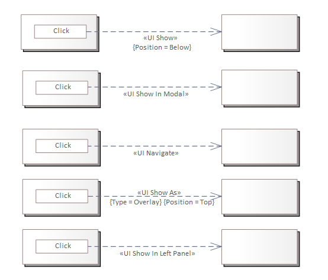

# Opis relacji wykorzystywanych do modelowania zależności między elementami interfejsów użytkownika

## Wprowadzenie

Relacje łączą dwa elementy znajdujące się na diagramie reprezentowane przez:

* [komponent](./component.md#komponent)
* [panel](./panel.md#panel)
* [elementy podstawowe](./basic-elements.md)

## Relacja uszczegółowienia

Opisywana jest stereotypem `UI Details`. Określa uszczegółowienie elementu źródłowego przez element docelowy. Ułatwia:

* przedstawienie struktury projektowanego interfejsu użytkownika,
* opisanie szczegółów poszczególnych elementów.

Relacja uszczegółowienia powinna być wykorzystywana w powiązaniu między komponentem i panelem lub między panelami. Grot strzałki relacji zależności wskazuje element stanowiący uszczegółowienie.

Na poniższym schemacie przedstawione zostały przykłady uszczegółowienia:

Przedstawione przykłady powinny być interpretowana w następujący sposób:

* użytkownik koszysta z elementu identyfikowanego na rysunku jako `source`,
* opis szczegółowy z dekompozycją przedstawiony jest na rysunku jako element identyfikowany jako `Source details`.

## Relacja rozszerzenia

Opisywana jest stereotypem `UI Extend`. Reprezentuje zależność dziedziczenia, charakterystycznego przy modelowaniu zorientowanym obiektowo. Jest to sugestia dla zespołu developerskiego, do wykorzystania już istniejącego elementu do implementacji elementu potrzebnego do realizacji projektowanego interfejsu użytkownika i wykorzystania technik dziedziczenia czy rozszerzenia w czasie prac (w zależności od ich dostępności w wykorzystywanych narzędziach).

Grot strzałki wskazuje element rodzica z którego dziedziczone są cechy przez element potomny (dziecko).

Relacja powinna być wykorzystywana do łączenia:

* komponent - komponent,
* panel - panel,
* element podstawowy - element podstawowy.

Przykłady rozszerzenia przedstawione zostały na poniższym rysunku:

## Relacja wyświetlania

Reprezentowana jest przez stereotypy:

* `UI Show`,
* `UI Show In Modal`,
* `UI Show In Left Panel`,
* `UI Navigate`.

Służą one do opisania zależności polegającej na wyświetleniu elementu wskazywanego przez grot strzałki na skutek zajścia zdarzenia na elemencie źródłowym (np. naciśnięcie przycisku, inicjalizacja). Sposób wyświetlenia opisuje stereotyp na relacji.

Na poniższym schemacie pokazane zostały przykłady wykorzystania relacji:

### UI Show

`UI Show` pokazuje najprostszą formę wyświetlenia. Może on być wykorzystywany do wyświetlenia fragmentu interfejsu użytkownika np. jakiejś listy wyboru, albo jakiejś wyszukiwarki uruchamianej kontekstowo. Wskazany grotem strzałki element jest wyświetlany względem elementu źródłowego relacji, w miejscu wskazanym atrybutem `Position`.

Powyższy przykład pokazuje wyświetlenie komponentu po kliknięciu w przycisk w pozycji przylegającej do przycisku pod nim.

### UI Show In Modal

`UI Show In Modal` reprezentuje formę wyświetlenia w której komponent docelowy pokazywany jest w tzw. modalu. Oznacza to wyświetlenie wskazanego grotem strzałki elementu w warstwie przykrywającej element źródłowy i zablokowanie możliwości korzystania z elementu źródłowego. Atrybut `Position` relacji wskazuje miejsce na ekranie widocznym przez użytkownika wyświetlania elementu. Podana w przykładzie wartość `Center` wycentrowanie zarówno w pionie, jak i w poziomie.

### UI Navigate

`UI Navigate` opisuje sytuację przeniesienia sterowania z jednego interfejsu użytkownika reprezentowanego przez komponent źródłowy do innego wskazywanego grotem strzałki. Relacja powinna być stosowana do obsługi typowej akcji nawigacyjnej powodującej zmianę funkcjonalności, w której źródłowy element zostaje zastąpiony przez docelowy.

### UI Show In Left Panel

`UI Show In Left Panel` relacja została dodana do MDG w celu zachowania kompatybilności z wcześniej realizowanymi projektami przez autorów. Będzie ona w przyszłości zastępowana relacją `UI Show In Modal` z ustawieniem atrybutu `Position` na `Left`. Relacja opisuje uruchomienie wskazanego komponentu w formie modala przypiętego do lewej strony widoku użytkownika. Wyświetlany element zajmuje przestrzeń od góry do dołu. Szerokość modala dostosowywana jest do szerokości uruchamianego w nim komponentu.

## Relacja wywołania

Reprezentowana jest przez stereotyp `UI Call`. Opisuje wywołanie operacji lub aktywności.

Na poniższym schemacie zostały pokazane przykłady wykorzystania relacji wywołania:

Relację można wykorzystać do powiązania operacji API, opisanej w dokumentacji zespołu backendowego. Pozwala to na wybudowanie bazy wiedzy zależności pomiędzy elementami działającego systemu i podejmowanie bardziej świadomych decyzji w sytuacji konieczności wprowadzania zmian.

Wywołanie operacji API może następować automatycznie przed, w trakcie, po wyświetleniu komponentu lub panelu. Sposób obsługi wywołania może być uszczegółowiony opisem przy wykorzystaniu [elementu zasady](./rule-elements.md#zasada) lub [elementu reguły przetwarzania danych](./rule-elements.md#zasada-przetwarzania-danych).
