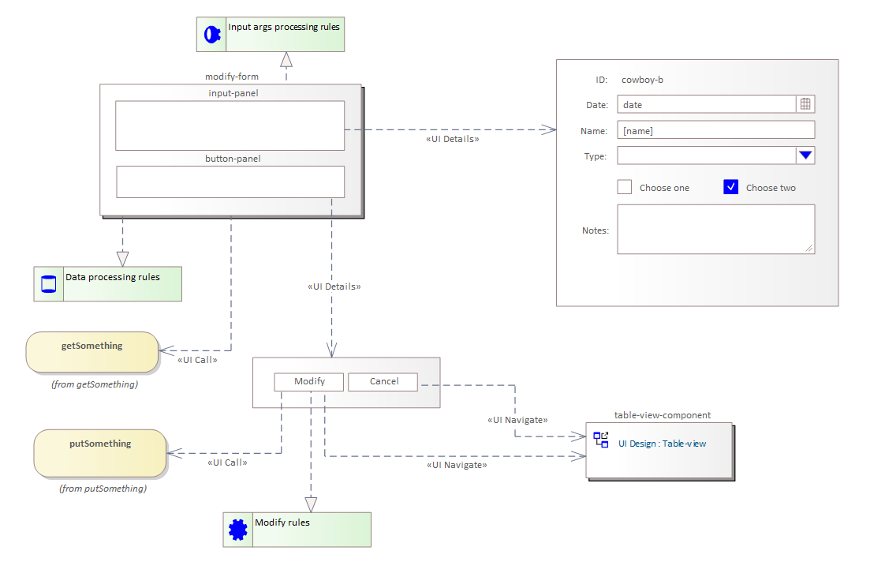

# Przykład formularza edycji danych

## Wprowadzenie

W niniejszym artykule omówiony został przykład modelu prostego formularza służącego do edycji danych.

## Model

Na powyższym schemacie przedstawiony został model interfejsu użytkownika prostego formularza modyfikacji danych.

Formularz jest uruchamiany z ustawieniem atrybutów opisanych w wymaganiu `Component attributes processing rules`. W przypadku formularza do edycji najczęstszą daną wejściową jest identyfikator rekordu podlegającego modyfikacji.

Dane formularza obsługiwane zgodnie z zasadami opisanymi w `UI data processing rules`. Wymaganie to opisuje zasady uruchomienia operacji `getSomething` czytającej edytowane dane i zapisu ich w stanie komponentu.

Formularz składa się z następujących elementów:

* panel danych edycji,
* panel operacji.

Oba mają uszczegółowienie powiązane relacją `UI Details`.

Panel edycji definiuje formularz który będzie widoczny użytkownikowi i będzie stanowić narzędzie do zmiany danych. Panel wizualizuje odczytane ze stanu komponentu dane i umożliwia ich zmianę.

W panelu operacji wyświetlane są dwa przyciski:

* `Modify`,
* `Cancel`.

Naciśnięcie przycisku `Modify` skutkuje wywołaniem, połączanej z nim relacją `UI Call` operacji `putSomething`, która zapisuje stan formularza. W sytuacjach nieoczywistych do opisu szczegółów wywołania operacji można użyć `elementu zasady`.