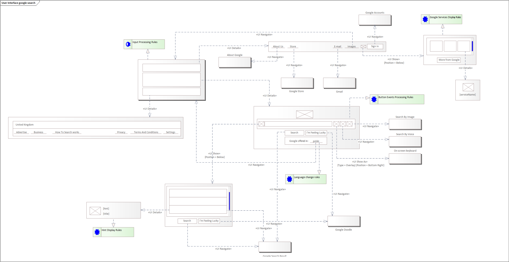

# Modelowanie interfejsu użytkownika na przykładzie wyszukiwarki Google

## Wprowadzenie

W niniejszym artykule omówiony został przykład wykorzystania modelowania interfejsów użytkownika w oparciu o wyszukiwarkę udostępnianą przez Google.

Przedstawiony model nie pokazuje pełnej złożoności wyszukiwarki Google.

## Wyszukiwarka Google

Na poniższym rysunku pokazana została strona wyszukiwarki:

Interfejs użytkownika wyszukiwarki można podzielić na 3 obszary:

* panel nagłówka (1)
* panel wyszukiwarki (2)
* panel stopki (3)

Powyższy podział przedstawiono na poniższym rysunku:

Panele nagłówka i wyszukiwarki to obszary funkcjonalne. Oprócz interfejsu użytkownika umożliwiającego wyszukiwanie, mamy możliwości zmiany trybu pracy, mamy opcje przejścia do innych usług udostępnianych przez Google.

Panel stopki to obszar informacyjny zawierający wymagane prawem informacje regulaminów i zasad poufności.

## Model

Poniższy obrazek pokazuje wyszukiwarkę Google w postaci modelu przy użyciu opisywanych narzędzi:

.

Wyszukiwarka została przedstawiona w postaci komponentu składającego się z 3 paneli. Każdy z paneli posiada powiązany panel uszczegóławiający. Panele obsługujące obszary 1 i 3 obsługują głównie linki albo do innych usług Google albo do informacji (regulamin, itp). Link w modelu przedstawiony jest w postaci przycisku. Kliknięcie w niego powoduje przejście do funkcjonalności opisanej w postaci komponentu. Do opisu przejścia wykorzystano relację `UI Navigate`.

Na uwagę zasługuje opcja znajdująca się po lewej stronie przycisku `Sign in`. Opcja ta została przedstawiona, na diagramie, przy pomocy przycisku, do którego dowiązany jest panel przy pomocy relacji `UI Show` z atrybutem `Position` ustawionym na `Below`. Reprezentuje to funkcjonalność wyświetlania, po naciśnięciu przycisku `Sign in`, panelu zestawiającego dostępne usługi Google. Panel jest wyświetlany pod przyciskiem. Usługi są przedstawione w postaci listy. Zestawiane są w formie trzy-kolumnowej. Każda usługa widoczna jest w postaci obrazka ikony i jej nazwy. Na diagramie lista pokazywana jest w postaci panelu scrollowalnego. Usługi to kolejne panele, do których relacją `UI Details` dowiązywany jest panel uszczegółowienia.

Obszar 2 opisuje podstawową funkcjonalność wyszukiwarki. Oprócz obrazka loga Google zawiera element umożliwiający wprowadzenie poszukiwanej frazy. Oprócz tego pokazywane są dodatkowe opcje. Wprowadzenie frazy w pole edycyjne lub naciśnięcie przycisku znajdującego się po lewej stronie pola edycyjnego skutkuje wyświetleniem panelu z podpowiedziami.

Panel ten jest wyświetlany pod polem edycyjnym (na modelu przedstawione zostało to przez połączenie przycisku z panelem przy pomocy relacji `UI Show` z atrybutem `Position` równym `Below`. Został wymodelowany w postaci listy elementów i przycisków opcji. Pozycja ma uszczegółowienie w postaci panelu zawierającego ikonę, podpowiedź i temat. Zasady wyświetlania danych podpowiedzi opisane zostały w dowiązanym do panelu wymaganiu.

Na szczególną uwagę zasługuje przycisk otwierający klawiaturę ekranową. Przycisk ten został zlokalizowany po prawej stronie elementu edycyjnego wyszukiwarki. Relacja (`UI Show As`) wiążącą ten przycisk z komponentem obsługującym klawiaturę ekranową opisuje sposób wyświetlenia jako nakładkę nieblokującą dostępu do przykrywanych opcji, wyświetlaną w prawym dolnym rogu widoku przeglądarki. Jest to opisane na relacji przy wykorzystaniu atrybutu `Type` o wartości `Overlay` i `Position` o wartości `Bottom Right`.
