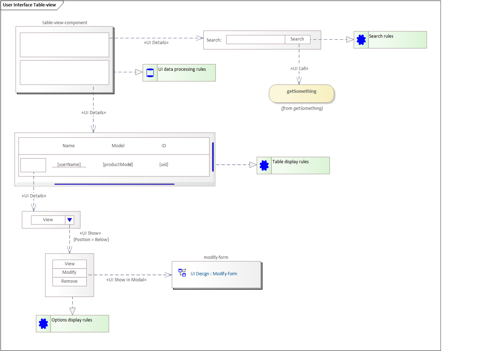

# Przykład interfejsu użytkownika zestawienia tabelarycznego z panelem filtrów

## Wprowadzenie

W niniejszym artykule omówiony został przykład modelowania interfejsu użytkownika typowego zestawienia danych. Zestawienie to składa się z panelu filtrów i tabelarycznego zestawienia danych.

## Model

Na powyższym schemacie przedstawiony został model komponentu interfejsu użytkownika obsługującego wyświetlanie zestawienia danych w postaci tabelarycznej.

Zasady przechowywania i obsługi danych wewnątrz komponentu zostały opisane w wymaganiu `UI data processing rules`.

Komponent składa się z dwóch elementów:

* zestawu pól umożliwiających wprowadzenie kryterium wyszukiwania,
* tabeli zestawiającej wyszukiwane dane.

Oba wymienione wyżej elementy mają uszczegółowienia przedstawione w postaci paneli powiązanych relacją `UI Details`.

Dane wyszukiwania to prosty formularz obejmujący:

* pole do wprowadzania danych tekstowych
* przycisk obsługujący odświeżanie danych zestawienia przy wykorzystaniu wprowadzonego kryterium wyszukiwania

Naciśnięcie przycisku `Search` skutkuje wywołanie operacji `getSomething`, która czyta dane i odświeża zestawienie. Zasady obsługi wywołania operacji opisane zostały w `Search rules`.

Operacja `getSomething` jest powiązany z przyciskiem relacją `UI Call`.

Zestawienie danych przedstawione zostało w postaci dwóch wierszy. Pierwszy wiersz definiuje nagłówek widoczny dla użytkownika i zestawiający nazwy pokazywanych danych. Drugi wiersz jest informacją dla wykonawców pokazującą dane odczytanego zestawienia które mają być pokazane użytkownikowi. Opis szczegółów dla wykonania został zawarty powiązanym z panelem wymaganiem `Table display rules`.

W pierwszej kolumnie zestawienia wyświetlana menu kontekstowe. Element ten ma uszczegółowienie pokazujące że obsługa tego ma być zrobiona w postaci elementu zawierającej jedną aktywną opcję `View` i możliwość rozwinięcia pozostałych opcji przez użytkownika po naciśnięciu przycisku. Rozwinięcie wyświetlane jest w postaci panelu zawierającego w układzie pionowym przyciski. Zasady wyświetlania i obsługi zawarta została w wymaganiu `Options display rules`.

Wybranie opcji `Modify` skutkuje uruchomieniem komponentu `modify-form`. Komponent modyfikacji ma swój projekt na diagramie `UI Design: Modify-form`.
